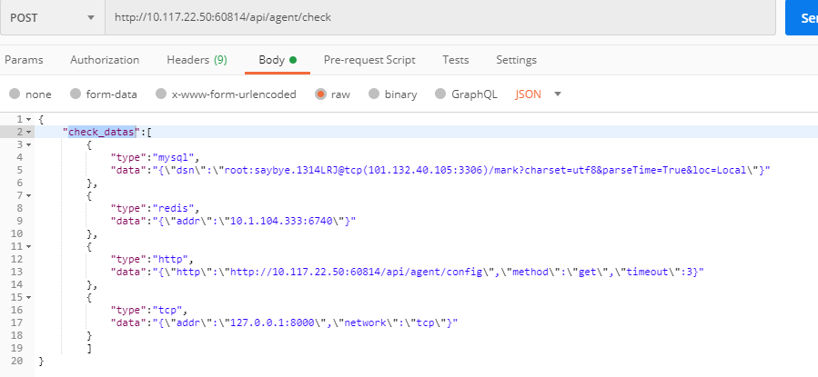

# Juno-Agent
Juno-Agent是一个提供服务代理、应用配置下发、应用配置解析、shell沙箱、探活、消息总线的Agent。

Juno-Agent的设计目标主要是让开发能够通过可插拔的组件，观测和治理自己的系统。

## 1. 配置管理

### 1.1 通过应用结构体获取客户配置

**获取接口的应用配置信息，接口配置参数**

|  名称 | 类型 | 描述 |
|:--------------|:-----|:-------------------|
|`name`| string | 应用名称 |
|`env`| string| 应用配置环境 |
|`port`| string | 应用治理端口 |
|`target`| string | 应用配置文件名称|

**返回参数**

|  名称 | 类型 | 描述 |
|:--------------|:-----|:-------------------|
|`code`| int | 接口响应状态吗，默认200为接口响应正常 |
|`msg`| string| 接口响应msg，如果接口出错，msg返回报错信息 |
|`data`| string | 返回的应用配置信息 |


**示例**
```
{
    name:juno-agent-test,
    env:dev,
    target:config-test.toml,
    port:8023
}
```

```bash
curl -X GET \
  'http://127.0.0.1:60814/api/v1/agent/config-test.toml?name=juno-agent-test&env=dev&port=8023'
```

```bash
{
    "code": 200,
    "data": "agent.test",
    "msg": "success"
}
```


### 1.2 直接通过应用配置原生key获取应用配置信息

针对不同的应用，会有不同的应用配置结构，因此提供一个直接根据key查询应用配置信息的接口


**获取接口的应用配置信息，接口配置参数**

|  名称 | 类型 | 描述 |
|:--------------|:-----|:-------------------|
|`rawKey`| string | 应用配置存储的key |

**返回参数**

|  名称 | 类型 | 描述 |
|:--------------|:-----|:-------------------|
|`code`| int | 接口响应状态吗，默认200为接口响应正常 |
|`msg`| string| 接口响应msg，如果接口出错，msg返回报错信息 |
|`data`| string | 返回的应用配置信息 |


### 1.3 长轮训监听配置信息,通过应用配置结构体获取

**获取接口的应用配置信息，接口配置参数**

|  名称 | 类型 | 描述 |
|:--------------|:-----|:-------------------|
|`name`| string | 应用名称 |
|`env`| string| 应用配置环境 |
|`port`| string | 应用治理端口 |
|`target`| string | 应用配置文件名称|
|`watch`| bool | 是否启用长轮训监听配置|
|`internal`| string | 长轮训间隔时长，不传默认60s|


**返回参数**

|  名称 | 类型 | 描述 |
|:--------------|:-----|:-------------------|
|`code`| int | 接口响应状态吗，默认200为接口响应正常 |
|`msg`| string| 接口响应msg，如果接口出错，msg返回报错信息 |
|`data`| confData | 返回的应用配置信息 |

```
// ContentNode ...
type ContentNode struct {
	Content string `json:"content"` // 应用部署配置内容
	Version int64  `json:"version"` // 应用部署配置版本
}
```

**示例**
```
{
    name:juno-agent-test,
    env:dev,
    target:config-test.toml,
    port:8023
}
```

```bash
curl -X GET \
  'http://127.0.0.1:60814/api/v1/agent/config?name=juno-agent-test&env=dev&port=8023&watch=true&internal=60&target=config-test.toml'
```

**当监听的配置文件发生变化时，会返回更新后的文档内容**
```
{
    "code": 200,
    "data": {
        "content": "agent.test",
        "version": 1590939362
    },
    "msg": "success"
}
```

**如果配置信息发生变化，则code==200，data为变化的配置信息**
**否则代表，无配置发生变更**

### 1.4 长轮训监听配置信息,通过原生key获取

**获取接口的应用配置信息，接口配置参数**

|  名称 | 类型 | 描述 |
|:--------------|:-----|:-------------------|
|`rawKey`| string | 完整的应用配置key，用户自定义 |
|`watch`| bool | 是否启用长轮训监听配置|
|`internal`| string | 长轮训间隔时长，不传默认60s|


**返回参数**

|  名称 | 类型 | 描述 |
|:--------------|:-----|:-------------------|
|`code`| int | 接口响应状态吗，默认200为接口响应正常 |
|`msg`| string| 接口响应msg，如果接口出错，msg返回报错信息 |
|`data`| confData | 返回的应用配置信息 |

```
// ContentNode ...
type ContentNode struct {
	Content string `json:"content"` // 应用部署配置内容
	Version int64  `json:"version"` // 应用部署配置版本
}
```

**如果配置信息发生变化，则code==200，data为变化的配置信息**
**否则代表，无配置发生变更**


## 2依赖探活
### 说明
  目前该组件支持http,mysql,redis,tcp的探活，应用方可以以主动拉取的形式来及时对
  应用依赖的组件进行探活
### POST /api/agent/check

**请求参数**

  |  名称 | 类型 | 描述 |
  | :------:| :------: | :------: |
  | `check_datas` | [] CheckDatas| 待探活组件相关信息 |
  
**接口返回**

 |  名称 | 类型 | 描述 |
 | :------:| :------: | :------: |
 | `code` | int | 状态码 |
 | `data` | [] ResHealthCheck | 探活结果 |
 | `msg` | string | 错误提示信息 |
     
### 调用示例
#### curl
```shell script
curl --location --request POST 'http://ip:port/api/v1/agent/check' \
--header 'Content-Type: application/json' \
--data-raw '{
	"check_datas":[
		{
			"type":"mysql",
			"data":"{\"dsn\":\"user:pwd@tcp(ip:port)/xxx?charset=utf8&parseTime=True&loc=Local\"}"
		},
		{
			"type":"redis",
			"data":"{\"addr\":\"ip:port\"}"
		},
		{
			"type":"http",
			"data":"{\"http\":\"http://ip:port/xxx\",\"method\":\"get\",\"timeout\":3}"
		},
		{
			"type":"tcp",
			"data":"{\"addr\":\"ip:port\",\"network\":\"tcp\"}"
		}
		]
}'
```
 #### postman
 

#### 自定义参数类型详解
 * CheckDatas

   |  名称 | 类型 | 描述 |
   | :------:| :------: | :------: |
   | `type` | string | 组件名称:目前支持(mysql,redis,http,tcp) |
   | `data` | string | 组件配置信息json串 |


  不同组件配置属性如下
  mysql

   |  名称 | 类型 | 描述 |
   | :------:| :------: | :------: |
   | `dsn` | string | mysql dsn连接串 |

   redis

   | 名称 | 类型 | 描述 |
   | :------:| :------: | :------: |
   | `dialTimeout` | time.Duration | 连接 超时时间 默认 1 s |
   | `readTimeout` | time.Duration | 读 超时时间 默认 1 s |
   | `writeTimeout` | time.Duration | 写 超时时间 默认 1 s |
   | `db` | int | 默认 0 |
   | `addr` | string | redis 连接串  |
   | `passWord` | string | 密码 |

  http

   |  名称 | 类型 | 描述 |
   | :------:| :------: | :------: |
   | `http` | string | http addr |
   | `header` | string | header |
   | `method` | string | method |
   | `timeout` | int64 | timeout |

  tcp

   |  名称 | 类型 | 描述 |
   | :------:| :------: | :------: |
   | `addr` | string | tcp addr |
   | `header` | string | header |
   | `network` | string | tcp tcp4 tcp6 |

  * ResHealthCheck

   |  名称 | 类型 | 描述 |
   | :------:| :------: | :------: |
   | `component_type` | string | 组件类型 |
   | `check_time` | int64 | 探活时间 |
   | `check_result` | CheckResult | 探活结果 |

   CheckResult

   |  名称 | 类型 | 描述 |
   | :------:| :------: | :------: |
   | `is_success` | bool | 此次探活结果falg |
   | `msg` | string | 探活失败提示信息 |


